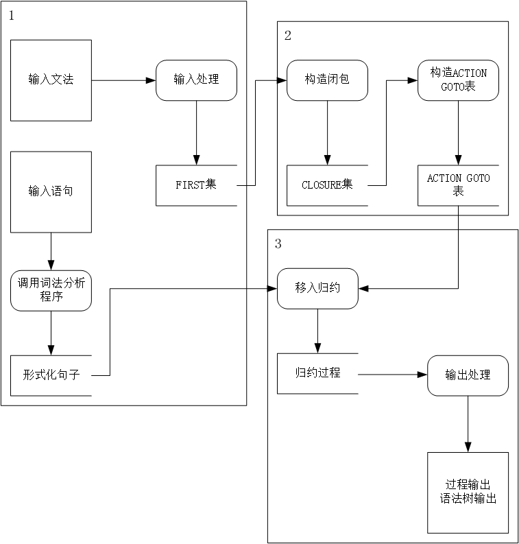

# Compiler

## Setup

1. Download *Flex* from [here](https://www.technorange.com/wp-content/uploads/Flex%20Windows%20%5BLex%20and%20Yacc%5D.exe) and install
2. Add the path of *flex.exe* and *gcc.exe* to the system environment
3. Clone the repository
4. Run the *run.bat*

## To Do

### Lex part

- [x] Rename the keywords
- [x] Rewrite the print function
- [x] Add more supporting symbols
- [ ] Add a function of pre-processing function, to read a whole sentence at once, delete comments and print the source codes

### Syntax part

- [ ] Grammar input process & create FIRST set
- [ ] Sentence input process & transform into FORMAL present
- [ ] from FIRST set to CLOSURE set
- [ ] from CLOSURE set to ACTION/GOTO table
- [ ] from FORMAL present & ACTION/GOTO table to solve the syntax
- [ ] show the result in a tree

## Requirement

### Input & Output

输入 **已知文法、单词串**

输出 **分析过程和语法树**

#### Data Flow



输入处理，变成内部的数据结构

```python
input="S->F KK | T" # use the space to spilt symbol, no space in around the ->
Grammar={
    # 'name':[symbol1List,symbol2List,...]
    'S':[[F,KK],[T]]
    'F':[...]
}
KeywordsList=['e','a',...]
```

求FIRST集

```python
FIRST={
    #'name':{first_set}
    'S':{F,T},
    'F':{...}
}
```

构造CLOSURE

```python
CLOSURE= [
    # [state1_closure,state2_closure]
    [# state 0
        #'name':[closure]
        'S':[
            	#[sentence,point_position]
                [ [F,T], 1 ],
                [...]
        ]
        'T':[...]
    ],
	[ #state 1
        ...
    ]
]
```

求ACTION表和GOTO表

```python
ACTION_GOTO=[
    # [state0_ac/goto,state1_ac/goto]
    [	# state 0 {ac:operation,goto:operation}
        'action':{
            #'name':[action,push_number]
            'S':[PUSH,3],
            'T':[POP,4]
        }
        'goto':{
            'S':[PUSH,3],
            'T':[POP,4]
        } 
    ]
    [
        # state 1...
    ]
]
```

从输入的单词串转为形式化句子

```python
input=String() # int a=5;
FORMAL_SENTENSE=[
    START,INT,VAR,EQU,NUM,END	# defined in lex
]
```

移进/归约分析

输出 **分析过程** 和 **语法树**

## Test data

```python
# ppt chapter 4 page 34
E->T E1
E->+ T E1 | e
T->F T1
T1->* F T1 | e
F->( E ) | i
#
+
*
e
i
(
)
#

# homework 4
S->a | b | ( T )
T->S T1
T1->, S T1 | e
#
(
)
a
b
,
e
#

# ppt chapter 5 page 120
S1->S
S->B B
B->a B
B->b

# declare varible
D->D_S
D_S->D_H D_B
D_H->KEYWORD_char | KEYWORD_int | KEYWORD_float | KEYWORD_double | KEYWORD_string
D_B->D_WV | D_WOV
D_WOV->id
D_WV->id assign VALUE
VALUE->integer | decimal | charConst | stringConst
#
integer
decimal
charConst
stringConst
id
assign
KEYWORD_char
KEYWORD_int
KEYWORD_float
KEYWORD_double
KEYWORD_string
#

```


